# 利用CPP构建流体模拟求解器(持续更新)

## 关于项目

本项目是学习Robert Bridson的《Fluid Simulation for Computer Graphics》一书的实践成果. 旨在使用现代C++从零开始，逐步构建3D流体模拟引擎. 部分代码由AI工具Gemini, Copilot协助完成.

## 复现进度: 
### Version 1

* **Grid_Construction**

    * 构建了向量数据类型 `Vector3D.h`以及网格数据类型 `grid.h`

    * 进一步构建了交错网格(MACGrid)用于存储流体的速度与压力数据. 
* **Advection**

    * 数值求解平流方程: $\frac{D\alpha}{Dt}=0$ (其中D为物质导数算子, $\alpha$为抽象变量, 无实际意义). 

    * 主要结合有限差分思想, 并运用半Lagrange方法进行离散化.

    * 对于数值耗散问题, 本项目忠于原书, 实现Catmull-Rom插值, 以降低数值耗散带来的隐患. 

* **Incompressible: Solver**

    * 初步建立简单边界(即任意网格中仅存在唯一物体形态)情形的求解器, 通过离散化压力梯度以及散度离散, 得到压力Poisson方程 $-\Delta t /\rho \nabla \cdot \nabla p=-\nabla \cdot  \vec{u}$ 及其离散格式 :
```math
   \begin{split}
   \frac{\Delta t}{\rho} \left( \frac{\begin{gathered} 6p_{i,j,k} - p_{i+1,j,k} - p_{i,j+1,k} - p_{i,j,k+1} \\ - p_{i-1,j,k} - p_{i,j-1,k} - p_{i,j,k-1} \end{gathered}}{\Delta x^2} \right) & = -\left( \begin{gathered} \frac{u_{i+1/2,j,k} - u_{i-1/2,j,k}}{\Delta x} + \frac{v_{i,j+1/2,k} - v_{i,j-1/2,k}}{\Delta x} \\ + \frac{w_{i,j,k+1/2} - w_{i,j,k-1/2}}{\Delta x} \end{gathered} \right).
   \end{split}
```

   * 根据离散形式, 我们可抽象出 $Ap=b$ 的大型稀疏线性方程系统. 并且得知 $A$ (在一般情况下)是对称正定矩阵, 少部分情况下是对称半正定矩阵. 对此, 求解器实现了bridson书中的MICCG(0)(零级修正不完全Cholesky共轭梯度法(modified incomplete Cholesky conjugate gradient, level zero))算法.

       算法简介: 该算法以PCG为求解主线, 并构建$A$的稀疏Cholesky因子作为预处理器, 加快收敛速度.
### Version 2
* **Incompressible:  More Accurate Curved Boundaries**

    * 学习有限体积法与差分法能量最小化思想后, 我们改进了`Solver.h`以及`Solver.cpp`中的代码, 精确计算被边界切割的单元格的流体体积分数和面积分数, 以构建更精确的压力方程. 

    * 通过符号距离函数(SDF)来描述任意光滑几何体(如球体等). 

    * 实现了基于SDF的精确粒子碰撞，使流体能与光滑曲面进行真实互动. 
* **Force & Scene**

    * Force文件夹旨在引入力学环境, 基于考量, 日后会陆续加载真实的力学环境以及虚拟的力学环境, 旨在多环境运用. 

    * Scene文件夹旨在引入更复杂的几何边界, 将引入多种几何体边界. 

### Version 3
* 学习marching cubes算法, 并在代码中集成了Thomas Lewiner的marching cubes LUT. 

## 构建与使用: 
本项目使用 CMake 进行构建, 请确保系统已安装C++编译器和CMake. 


### 参考文献
* Bridson, R. (2015). Fluid simulation for computer graphics (2nd ed.). CRC Press.

* Golub, G. H., & Van Loan, C. F. (2013). Matrix computations (4th ed.). Johns Hopkins University Press.

### 模拟流程

```mermaid
graph TD
    %% 定义样式
    style A fill:#e6f3ff,stroke:#0066cc,stroke-width:2px
    style B fill:#e6ffe6,stroke:#009900,stroke-width:2px
    style C fill:#fff0e6,stroke:#ff6600,stroke-width:2px
    style D fill:#f2e6ff,stroke:#9933ff,stroke-width:2px

    subgraph A["🏗️ A. 核心数据与构建"]
        Grid_Construction("
            <b>Grid_Construction</b><br/>
            定义模拟世界的基础<br/><hr>
            - <b>MACGrid</b>: 存储速度与压力的交错网格<br/>
            - <b>Particles</b>: 流体的核心载体 (FLIP)<br/>
            - <b>SDFUtils</b>: 用于精确处理曲面边界
        ")
    end

    subgraph B["🌍 B. 场景与物理设定"]
        Scene("
            <b>Scene</b><br/>
            一次性搭建模拟初始状态<br/><hr>
            - <b>SceneManager</b>: 创建鱼缸、水坝等场景<br/>
            - <b>Emitters</b>: 持续向场景中发射粒子<br/>
            - <b>SolidShape</b>: 定义球体等几何边界
        ")
        Force("
            <b>Force & Boundary</b><br/>
            在每帧中强制执行的物理法则<br/><hr>
            - <b>GravityForce</b>: 施加重力<br/>
            - <b>SolidBoundary</b>: 处理与固体墙壁的碰撞
        ")
    end

    subgraph C["⚙️ C. 核心模拟循环"]
        Advection("
            <b>Advection</b><br/>
            物质输运，负责“推动”一切<br/><hr>
            - <b>FLIP/PIC混合法</b>: 结合粒子与网格优势，更新粒子速度与位置<br/>
            - <b>P2G / G2P</b>: 粒子与网格间数据传递的核心步骤
        ")
        Solver("
            <b>Solver</b><br/>
            解算压力，维持流体不可压缩性<br/><hr>
            - <b>压力泊松方程</b>: 求解该方程以获得压力场<br/>
            - <b>MICCG(0) 求解器</b>: 高效求解大型稀疏线性系统的关键算法
        ")
    end

    subgraph D["📊 D. 输出与可视化"]
        Surface("
            <b>Surface</b><br/>
            从离散数据重建光滑表面<br/><hr>
            - <b>重建流体SDF</b>: 从粒子位置生成水平集<br/>
            - <b>Marching Cubes</b>: 从SDF提取三角网格的关键算法
        ")
        IO("
            <b>IO</b><br/>
            将结果保存为文件<br/><hr>
            - <b>exportMeshToObj</b>: 导出为标准的 .obj 3D模型文件
        ")
    end

    %% 流程连接
    A -- "提供数据结构" --> B
    B -- "一次性初始化" --> C
    C -- "<b>核心循环(每一帧)</b>" --> C
    C -- "帧结束，输出结果" --> D
```

